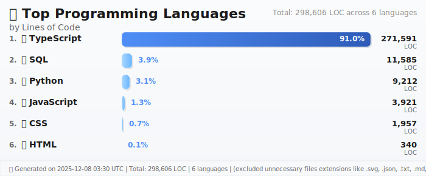

# 👋 Hey! I'm Guillermo

  

I build things. Sometimes they work, sometimes they don't, but I always learn something along the way.

  
  
  

---

## 🚀 What I'm Up To

### 💼 **My Story**
I started coding because I wanted to build things that could actually help people. What began as simple scripts has turned into a passion for creating meaningful applications. I love the challenge of taking a complex problem and turning it into something elegant and useful.

**🔭 Right now:** Working on AI-powered real estate platforms and trying to make invoice processing less painful
**🌱 Learning:** New AI/ML techniques, microservices, and whatever catches my interest
**👯 Looking for:** Cool projects to collaborate on, especially open source stuff
**💬 Ask me about:** React, TypeScript, Python, AI/ML, or anything tech-related - I love talking shop!
**📫 Get in touch:** [LinkedIn](https://linkedin.com/in/guillermoastorgacalvo) | [Email](mailto:guillermo.astorga.calvo@gmail.com)

### 🎯 **What I Do**
- **Frontend Development**: Building interfaces that people actually want to use
- **Backend Development**: Creating APIs and services that don't break when you need them most
- **AI & ML**: Adding intelligence to applications in ways that actually make sense
- **Database & Cloud**: Making sure data is where it needs to be when it needs to be there
- **DevOps**: Automating the boring stuff so I can focus on building

---

## 📊 **My Private Repository Stats**

> 📊 **Real data from my private enterprise repositories**
> _Updated every Monday - this is where the real work happens!_

<!-- Dynamic Stats Overview -->

        

### **👨‍💻 My Contributions**
🎯 **99.9% of all code** (41,255 lines)
📝 **40 commits** across all projects
📁 **140 files** created or modified

### **⚡ Productivity Metrics**
🚀 **1031 lines per commit**
📊 **3.5 files per commit**
💡 **295 lines per file**

### **💻 Top Languages**

  

### **🏢 Top Projects**
• **TypeScript Backend** - 41,255 lines (99.9% contribution)

### **💡 Key Insights**

These numbers tell the real story - late nights debugging, moments of breakthrough, and a lot of trial and error. Every line of code represents a problem solved or something new learned. The private repos are where the magic happens!

---

## 🛠️ **Technology Stack**

  

I believe in using the right tool for the job. Here's my current technology stack based on my projects:

### **🌐 Frontend Development**

  

**Technologies:** `js`, `nextjs`, `react`, `supabase`, `tailwind`, `ts`

### **⚙️ Backend Development**

  

**Technologies:** `express`, `fastapi`, `jest`, `nodejs`, `prometheus`, `py`, `redis`, `ts`

### **🗄️ Database & Cloud**

  

**Technologies:** `postgres`

### **🤖 AI & Machine Learning**

  

**Technologies:** `opencv`, `py`

**Additional:** `langchain`, `tesseract`, `openai`

### **🛠️ Development Tools**

  

**Technologies:** `docker`

### **📈 Technology Summary**
- **Total Technologies with Icons:** 18
- **Total Original Dependencies:** 25
- **Categories Analyzed:** 5

---
## 🚀 **Stuff I've Built**

  

Here are some projects I'm pretty proud of. Each one taught me something different and pushed me to grow.

### 🏆 **InmoIA Frontend**
🟢 Active Development • A real estate platform that actually helps people find their perfect home. Started as a simple listing site and grew into something much bigger.

**Tech Stack:**    

**What it does:**
- AI Property Matching
- Virtual Tours
- Analytics Dashboard

**The backstory:** This one started small - just a basic property listing. But as I worked on it, I kept thinking 'what if we could make this smarter?' Now it's a full SaaS platform. The journey from simple to complex taught me so much about scaling React apps.

**🔗 [Check it out](https://github.com/guillermo-affiliaction/housing-hub-saas)**

---
### 🏆 **TypeScript Backend**
🟢 Active Development • The engine that powers everything. Built this microservices architecture to handle the heavy lifting - authentication, data processing, you name it.

**Tech Stack:**    

**What it does:**
- REST APIs
- Authentication
- Database Management

**The backstory:** TypeScript changed everything for me. The first time I refactored this backend with proper types, I realized what I'd been missing. Now I can't imagine building anything complex without it.

**🔗 [Check it out](https://github.com/guillermo-affiliaction/backend-housing-hub-saas)**

---
### 🏆 **Python AI MCP Backend**
🟢 Active Development • This is where things get interesting. Built an AI backend that can understand what you're asking and actually do something about it.

**Tech Stack:**    

**What it does:**
- AI Task Completion
- Natural Language Processing
- MCP Integration

**The backstory:** I was skeptical about AI at first, but seeing this system understand natural language requests blew my mind. It's like having a really smart assistant that actually gets things done.

**🔗 [Check it out](https://github.com/guillermo-affiliaction/IAbackend-inmoIA)**

---
### 🏆 **FacturaIA**
🟡 In Development • Got tired of manually processing invoices, so I built something to do it for me. Sometimes the best projects come from solving your own problems.

**Tech Stack:**    

**What it does:**
- OCR Processing
- Data Extraction
- Invoice Management

**The backstory:** This was born from pure frustration. I was manually processing invoices one day and thought 'there has to be a better way.' Turns out there was - I just had to build it.

**🔗 [Check it out](https://github.com/GuillermoAstorgaCalvo/FacturaIA)**

---
### 🏆 **Restaurant App**
🟢 Live • My first full-stack project that actually went live. Built it for a friend's restaurant and it's still running today.

**Tech Stack:**    

**What it does:**
- Order Management
- Menu System
- Admin Dashboard

**The backstory:** This was the project that made me realize I could actually build things people would use. Seeing real customers place orders through something I built was incredibly satisfying.

**🔗 [Check it out](https://restauranteguillermoastorga.up.railway.app/)**

---
## 💼 **Experience & Growth**

### **🎯 What I Focus On**
I build full-stack applications that solve real problems. My approach is pretty simple - use modern tools, write clean code, and focus on what actually matters to users. I love working with AI and finding ways to make applications smarter without overcomplicating things.

### **🏆 What I've Done**
- **Built SaaS platforms** that handle real traffic and don't crash
- **Added AI features** that actually improve user experience
- **Maintained code quality** across multiple projects
- **Learned to balance** quick development with long-term maintainability

### **📈 My Journey**
- **Started with simple scripts** and gradually tackled bigger challenges
- **Discovered TypeScript** and realized what I'd been missing
- **Explored AI/ML** and found ways to make it practical
- **Embraced DevOps** to make development less painful

The numbers in my stats aren't just metrics - they're late nights, debugging sessions, and moments of "aha!" Every commit represents a problem solved or something new learned.

---

## 🌟 **Let's Connect**

  

I'm always up for connecting with fellow developers, discussing interesting projects, or exploring new opportunities. Whether you want to collaborate on something cool, ask about my projects, or just say hello - I'd love to hear from you!

  
  
  
  

---

*Last updated: August 02, 2025 at 08:43 UTC*
